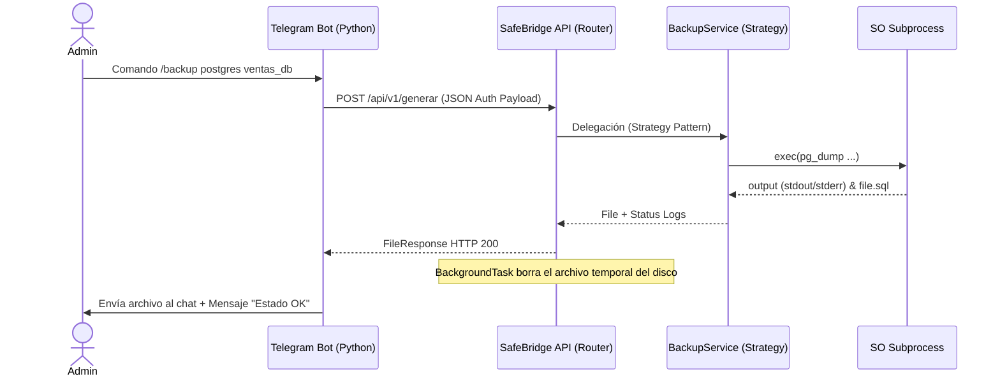

<center>


**UNIVERSIDAD PRIVADA DE TACNA**

**FACULTAD DE INGENIERÍA**

**Escuela Profesional de Ingeniería de Sistemas**

**Proyecto: *SafeBridge: Ecosistema Multi-Motor de Respaldos y Validación de Integridad***

Curso: *Base de Datos II*

Docente: *Ing. Patrick José Cuadros Quiroga*

Integrantes:

***Sierra Ruiz, Iker Alberto (2023077090)***

***Cortez Mamani, Julio Samuel (2023077283)***

**Tacna – Perú**

***2026***

</center>

<div style="page-break-after: always; visibility: hidden"></div>

Sistema *SafeBridge*

Historias de Usuario y Escenarios de Prueba — FD03

Versión *3.0*

| CONTROL DE VERSIONES | | | | | |
|:---:|:---|:---|:---|:---|:---|
| Versión | Hecha por | Revisada por | Aprobada por | Fecha | Motivo |
| 2.0 | IASR / JSCM | Ing. P. Cuadros | Ing. P. Cuadros | 31/05/2026 | Actualización para Rust MVP Architecture |
| 3.0 | IASR / JSCM | Ing. P. Cuadros | Ing. P. Cuadros | 03/07/2026 | Reescritura para Ecosistema (Telegram, VSCode, GH Action) |

<div style="page-break-after: always; visibility: hidden"></div>

# ÍNDICE GENERAL

- [1. Historias de Usuario](#1-historias-de-usuario)
- [2. Criterios de Aceptación](#2-criterios-de-aceptación)
- [3. Escenarios de Prueba (Gherkin)](#3-escenarios-de-prueba-gherkin)
- [4. Diagramas de Secuencia](#4-diagramas-de-secuencia)

<div style="page-break-after: always; visibility: hidden"></div>

---

## 1. Historias de Usuario

### HU-01 — Generación de Respaldos vía Telegram
**Módulo**: API / Telegram Bot  
**Prioridad**: Alta  
> **Como** administrador de base de datos remoto,  
> **quiero** solicitar un respaldo de base de datos enviando un mensaje a mi Bot de Telegram,  
> **para** que el motor FastAPI asíncrono genere el volcado y el Bot me devuelva el archivo físico junto con el log de estado, sin importar dónde me encuentre.

### HU-02 — Verificación de Integridad en el IDE (VS Code)
**Módulo**: VS Code Extension  
**Prioridad**: Media  
> **Como** desarrollador de software que está revisando un archivo `.sql` de base de datos,  
> **quiero** ejecutar un comando dentro de VS Code (`SafeBridge: Verificar`),  
> **para** comprobar inmediatamente la integridad de las firmas EOF (End Of File) sin salir de mi editor de código.

### HU-03 — Validación CI/CD Automática de Archivos .bak
**Módulo**: GitHub Action  
**Prioridad**: Crítica  
> **Como** ingeniero DevSecOps,  
> **quiero** agregar una regla en mis Workflows de GitHub que detecte archivos `.bak`,  
> **para** que el sistema levante dinámicamente un contenedor SQL Server, verifique la integridad y devuelva error si el backup subido al repositorio está corrupto.

---

## 2. Criterios de Aceptación

### CA-01 — Ejecución Segura en FastAPI
- El endpoint `POST /api/v1/generar` debe validar la estructura del JSON con Pydantic.
- El servicio aplica el *Strategy Pattern* para instanciar la clase correcta (`PostgresEngine`, `MySQLEngine`, etc.).
- El archivo generado se adjunta y luego es destruido del servidor (BackgroundTasks) para evitar el llenado del disco.

### CA-02 — Verificación en CI/CD (GitHub Actions)
- Si el archivo es PostgreSQL (`.sql`), se lee su EOF y responde en menos de 1 segundo.
- Si el archivo es SQL Server (`.bak`), se invoca Docker y se ejecuta `RESTORE VERIFYONLY`.

### CA-03 — Experiencia en VS Code
- Si un archivo tiene tamaño 0 bytes o le falta la firma, la extensión lanza un modal (Toast Message) de Error en la UI de VS Code indicando corrupción.

---

## 3. Escenarios de Prueba (Gherkin)

### Escenario 1 — Generación y entrega vía Telegram
```gherkin
Feature: API de Telegram para descargas de bases de datos
  Como administrador remoto
  Quiero orquestar FastAPI a través de un Bot

  Scenario: Solicitud de backup válida
    Given un usuario autenticado chatea con el SafeBridge Bot
    When el usuario solicita un respaldo de la base "Ventas" en PostgreSQL
    Then el Bot envía la petición a FastAPI (`POST /api/v1/generar`)
    And FastAPI ejecuta `pg_dump` de forma asíncrona
    And FastAPI devuelve un FileResponse y headers HTTP `X-Backup-Status`
    And el Bot de Telegram reenvía el archivo `.sql` físico y un mensaje indicando "SUCCESS" al chat del usuario.
```

### Escenario 2 — Integración Continua con SQL Server
```gherkin
Feature: GitHub Action de Verificación
  Como servidor CI/CD
  Quiero fallar el pipeline si el backup no sirve

  Scenario: Detección de un archivo .bak corrupto
    Given el desarrollador hace git push de `db_prod.bak`
    When el workflow activa la acción `safebridge-action`
    And el core Python detecta la extensión .bak y levanta el contenedor SQL Server
    Then `RESTORE VERIFYONLY` falla al procesar la cabecera
    And la acción devuelve `Exit code 1`
    And el Pull Request en GitHub aparece con aspa roja (bloqueado).
```

---

## 4. Diagramas de Secuencia

### 4.1. Flujo Completo Telegram - FastAPI


