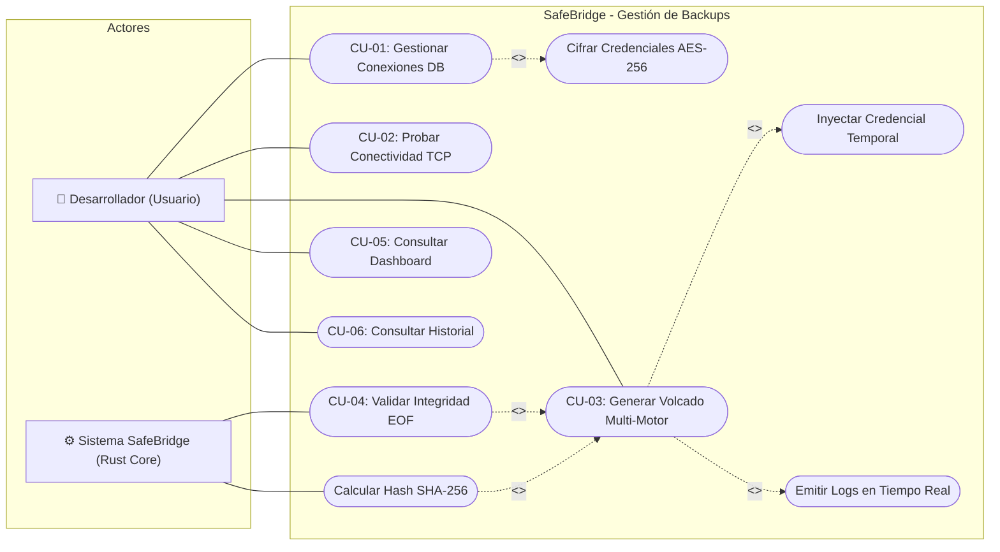

<center>


**UNIVERSIDAD PRIVADA DE TACNA**

**FACULTAD DE INGENIERÍA**

**Escuela Profesional de Ingeniería de Sistemas**

**Proyecto: *SafeBridge: Orquestador Multi-Motor de Respaldos y Validación de Integridad***

Curso: *Base de Datos II*

Docente: *Ing. Patrick José Cuadros Quiroga*

Integrantes:

***Sierra Ruiz, Iker Alberto (2023077090)***

***Cortez Mamani, Julio Samuel (2023077283)***

**Tacna – Perú**

***2026***

</center>

<div style="page-break-after: always; visibility: hidden"></div>

Sistema *SafeBridge*

Especificación de Requerimientos del Sistema — FD03

Versión *3.0*

| CONTROL DE VERSIONES | | | | | |
|:---:|:---|:---|:---|:---|:---|
| Versión | Hecha por | Revisada por | Aprobada por | Fecha | Motivo |
| 1.0 | IASR / JSCM | Ing. P. Cuadros | Ing. P. Cuadros | 12/04/2026 | Versión Original |
| 2.0 | IASR / JSCM | Ing. P. Cuadros | Ing. P. Cuadros | 11/06/2026 | Actualización BDD y migración de diagramas |
| 3.0 | IASR / JSCM | Ing. P. Cuadros | Ing. P. Cuadros | 04/07/2026 | Especificación completa: Requerimientos, Casos de Uso y BDD |

<div style="page-break-after: always; visibility: hidden"></div>

# ÍNDICE GENERAL

- [1. Requerimientos del Sistema](#1-requerimientos-del-sistema)
  - [1.1 Requerimientos Funcionales](#11-requerimientos-funcionales)
  - [1.2 Requerimientos No Funcionales](#12-requerimientos-no-funcionales)
- [2. Casos de Uso del Sistema](#2-casos-de-uso-del-sistema)
- [3. Diagrama de Casos de Uso](#3-diagrama-de-casos-de-uso)
- [4. Historias de Usuario](#4-historias-de-usuario)
- [5. Criterios de Aceptación](#5-criterios-de-aceptación)
- [6. Escenarios de Prueba (BDD)](#6-escenarios-de-prueba-bdd)

<div style="page-break-after: always; visibility: hidden"></div>

---

## 1. Requerimientos del Sistema

### 1.1 Requerimientos Funcionales

| ID | Nombre | Descripción | Prioridad | Módulo |
|:--:|--------|-------------|:---------:|--------|
| RF-01 | Registro de conexiones | El sistema debe permitir al usuario registrar conexiones de base de datos especificando: nombre, motor (postgres/mysql/sqlserver/mongodb), host, puerto, usuario, contraseña, nombre de BD y carpeta de destino. | Alta | Conexiones |
| RF-02 | Listado de conexiones | El sistema debe listar todas las conexiones registradas sin exponer la contraseña al frontend. | Alta | Conexiones |
| RF-03 | Edición de conexiones | El sistema debe permitir modificar los datos de una conexión existente. Si no se proporciona contraseña nueva, se mantiene la anterior. | Media | Conexiones |
| RF-04 | Eliminación de conexiones | El sistema debe permitir eliminar conexiones. Los logs históricos asociados deben mantenerse (ON DELETE SET NULL). | Media | Conexiones |
| RF-05 | Prueba de conectividad TCP | El sistema debe probar la conectividad TCP hacia el host y puerto especificados con un timeout de 3 segundos. | Media | Conexiones |
| RF-06 | Cifrado de contraseñas | El sistema debe cifrar automáticamente las contraseñas con AES-256-GCM antes de almacenarlas en SQLite. | Alta | Seguridad |
| RF-07 | Generación de backup multi-motor | El sistema debe orquestar la ejecución de sidecars nativos (`pg_dump`, `mysqldump`, `sqlcmd`, `mongodump`) según el motor seleccionado. | Crítica | Backup |
| RF-08 | Emisión de logs en tiempo real | El sistema debe emitir eventos (`backup_log`) al frontend con mensajes y niveles (info/success/error) durante el proceso de backup. | Alta | Backup |
| RF-09 | Cálculo de hash SHA-256 | El sistema debe calcular el hash SHA-256 del archivo generado leyendo en chunks de 8KB para eficiencia de memoria. | Alta | Validación |
| RF-10 | Verificación de firma EOF | El sistema debe leer los últimos 256 bytes del archivo generado para buscar la firma de conclusión del motor correspondiente. | Alta | Validación |
| RF-11 | Registro de logs de backup | El sistema debe insertar un registro en `backup_logs` con: ID, conexión, motor, tiempos, tamaño, estado, verificación y logs completos. | Alta | Auditoría |
| RF-12 | Dashboard de estadísticas | El sistema debe mostrar KPIs: total conexiones, backups exitosos, fallidos y datos resguardados en bytes, junto con actividad reciente. | Media | Dashboard |
| RF-13 | Historial filtrable | El sistema debe permitir filtrar el historial de logs por motor de BD y estado (OK/FAIL) y buscar por nombre de conexión. | Media | Historial |
| RF-14 | Detalle de log | El sistema debe permitir ver el detalle completo de un log incluyendo: ruta, tamaño, SHA-256, verificación EOF, mensajes de error y logs crudos. | Media | Historial |
| RF-15 | Verificación de Docker | El sistema debe verificar si Docker Desktop está disponible ejecutando `docker info` y mostrar un indicador visual. | Baja | Sistema |
| RF-16 | Selección de carpeta nativa | El sistema debe permitir seleccionar la carpeta de destino del backup mediante el diálogo nativo del sistema operativo (Tauri Dialog Plugin). | Media | UI |

### 1.2 Requerimientos No Funcionales

| ID | Categoría | Descripción | Métrica |
|:--:|-----------|-------------|---------|
| RNF-01 | Rendimiento | El cálculo de hash SHA-256 debe realizarse sin cargar el archivo completo en RAM (lectura por chunks de 8KB). | Uso de RAM < 50 MB para archivos de cualquier tamaño |
| RNF-02 | Seguridad | Las contraseñas nunca deben transmitirse en texto plano al frontend ni almacenarse sin cifrar en disco. | 0 contraseñas en texto plano |
| RNF-03 | Seguridad | Las contraseñas deben cifrarse con AES-256-GCM con nonce aleatorio de 12 bytes y codificarse en Base64. | Algoritmo AES-256-GCM |
| RNF-04 | Disponibilidad | La aplicación debe funcionar 100% offline sin requerir conexión a internet para sus funciones core. | 100% operabilidad offline |
| RNF-05 | Usabilidad | La interfaz debe mostrar feedback en tiempo real durante operaciones de backup con logs estilo terminal. | Latencia de UI < 100ms |
| RNF-06 | Portabilidad | La aplicación debe compilar para Windows y Linux mediante Tauri Bundler. | 2 plataformas soportadas |
| RNF-07 | Escalabilidad | El esquema de BD debe permitir agregar nuevos motores sin modificar la estructura de tablas. | Motor como campo TEXT libre |
| RNF-08 | Integridad | Los registros de auditoría (backup_logs) deben ser inmutables. No se permite UPDATE ni DELETE sobre ellos. | 0 operaciones de modificación |
| RNF-09 | Compatibilidad | El sistema debe soportar los motores: PostgreSQL, MySQL, SQL Server y MongoDB. | 4 motores soportados |
| RNF-10 | Mantenibilidad | El código backend debe seguir convenciones idiomáticas de Rust (snake_case, Result<T,E>, sin unwrap en producción). | Cumplimiento clippy |

<div style="page-break-after: always; visibility: hidden"></div>

---

## 2. Casos de Uso del Sistema

### CU-01 — Gestionar Conexiones de Base de Datos

| Campo | Descripción |
|-------|-------------|
| **ID** | CU-01 |
| **Nombre** | Gestionar Conexiones de Base de Datos |
| **Actor Principal** | Desarrollador (Usuario) |
| **Precondición** | La aplicación SafeBridge está abierta. |
| **Postcondición** | La conexión queda registrada/actualizada/eliminada en SQLite con contraseña cifrada. |
| **Flujo Principal** | 1. El usuario navega a la sección "Conexiones". <br> 2. El sistema muestra las conexiones existentes (sin contraseñas). <br> 3. El usuario hace clic en "Nueva Conexión". <br> 4. El sistema muestra el formulario lateral (ConnectionForm). <br> 5. El usuario ingresa: nombre, motor, host, puerto, usuario, contraseña, nombre BD y carpeta. <br> 6. El usuario presiona "Guardar". <br> 7. El sistema cifra la contraseña con AES-256-GCM. <br> 8. El sistema genera un UUID v4 e inserta el registro en SQLite. <br> 9. El sistema cierra el formulario y actualiza la lista. |
| **Flujo Alternativo** | **3a.** El usuario selecciona "Editar" en una conexión existente → se carga el formulario con los datos (sin contraseña). <br> **3b.** El usuario selecciona "Eliminar" → se solicita confirmación → se ejecuta DELETE con ON DELETE SET NULL en logs. |
| **Excepciones** | **E1.** Campos obligatorios vacíos → Toast de error. <br> **E2.** Puerto fuera de rango (0-65535) → Toast de error. <br> **E3.** Error de cifrado → No se guarda la conexión. |

---

### CU-02 — Probar Conectividad de Red

| Campo | Descripción |
|-------|-------------|
| **ID** | CU-02 |
| **Nombre** | Probar Conectividad de Red (Ping TCP) |
| **Actor Principal** | Desarrollador (Usuario) |
| **Precondición** | El formulario de conexión está abierto con host y puerto definidos. |
| **Postcondición** | El usuario recibe feedback visual sobre la conectividad (éxito/fallo). |
| **Flujo Principal** | 1. El usuario presiona "Probar Conexión (Ping TCP)". <br> 2. El frontend invoca `test_connection(host, port)` vía Tauri IPC. <br> 3. Rust intenta `TcpStream::connect_timeout` con 3 segundos de timeout. <br> 4. Si el host responde, retorna `true` → UI muestra "Conexión TCP exitosa" en verde. |
| **Flujo Alternativo** | **4a.** Timeout → Retorna error → UI muestra mensaje de fallo en rojo. |

---

### CU-03 — Generar Volcado (Backup) Multi-Motor

| Campo | Descripción |
|-------|-------------|
| **ID** | CU-03 |
| **Nombre** | Generar Volcado Multi-Motor |
| **Actor Principal** | Desarrollador (Usuario) |
| **Actor Secundario** | Sistema SafeBridge (Rust Core) |
| **Precondición** | Existe al menos una conexión registrada. El sidecar del motor está disponible. |
| **Postcondición** | Se genera un archivo de backup en disco, se calcula su hash SHA-256, se verifica la firma EOF, y se registra todo en backup_logs. |
| **Flujo Principal** | 1. El usuario navega a "Generar Backup". <br> 2. El sistema carga las conexiones disponibles en un dropdown. <br> 3. El usuario selecciona una conexión y presiona "Iniciar Backup". <br> 4. El sistema registra `start_time` y crea un buffer de logs. <br> 5. El sistema consulta la conexión en SQLite y descifra la contraseña. <br> 6. El sistema genera el nombre de archivo con formato `{db}_{YYYYMMDD_HHMMSS}.{ext}`. <br> 7. El sistema ejecuta el sidecar correspondiente con la contraseña en variable de entorno temporal. <br> 8. El sistema emite logs en tiempo real al frontend. <br> 9. Al finalizar, calcula SHA-256 por chunks de 8KB. <br> 10. El sistema verifica la firma EOF leyendo los últimos 256 bytes. <br> 11. El sistema inserta el registro en `backup_logs`. <br> 12. El frontend muestra resultado (OK/FAIL) con card visual. |
| **Excepciones** | **E1.** Conexión no encontrada → Error inmediato. <br> **E2.** Sidecar no disponible → Error con log detallado. <br> **E3.** Archivo vacío (0 bytes) → verified = false. <br> **E4.** Firma EOF ausente → verified = false, status = FAIL. |

---

### CU-04 — Validar Integridad del Archivo

| Campo | Descripción |
|-------|-------------|
| **ID** | CU-04 |
| **Nombre** | Validar Integridad Nativa (EOF + SHA-256) |
| **Actor Principal** | Sistema SafeBridge (automático) |
| **Precondición** | Un archivo de backup ha sido generado exitosamente en disco. |
| **Postcondición** | El campo `restore_verified` queda definido como true/false en el log. |
| **Flujo Principal** | 1. El sistema abre el archivo generado. <br> 2. Si el tamaño es 0 bytes → verified = false. <br> 3. Para MySQL: busca `"Dump completed on"` en últimos 256 bytes. <br> 4. Para PostgreSQL: busca `"PostgreSQL database dump complete"`. <br> 5. Para SQL Server / MongoDB: validación por tamaño (> 0). <br> 6. El sistema calcula SHA-256 con hasher de chunks de 8KB. <br> 7. Retorna `(file_path, size, sha256, verified)`. |

---

### CU-05 — Consultar Dashboard

| Campo | Descripción |
|-------|-------------|
| **ID** | CU-05 |
| **Nombre** | Consultar Dashboard de Estadísticas |
| **Actor Principal** | Desarrollador (Usuario) |
| **Precondición** | La aplicación está abierta. |
| **Postcondición** | El usuario visualiza KPIs actualizados. |
| **Flujo Principal** | 1. El usuario navega al Dashboard. <br> 2. El frontend invoca `get_dashboard_stats`. <br> 3. Rust consulta: COUNT conexiones, COUNT backups OK, COUNT backups FAIL, SUM bytes, últimos 5 logs. <br> 4. Se despliegan 4 tarjetas KPI y una tabla de actividad reciente. |

---

### CU-06 — Consultar Historial y Auditoría

| Campo | Descripción |
|-------|-------------|
| **ID** | CU-06 |
| **Nombre** | Consultar Historial de Backups |
| **Actor Principal** | Desarrollador (Usuario) |
| **Precondición** | Existen registros en `backup_logs`. |
| **Postcondición** | El usuario puede ver, filtrar y detallar los registros de auditoría. |
| **Flujo Principal** | 1. El usuario navega a "Historial". <br> 2. El sistema carga los logs ordenados por fecha descendente. <br> 3. El usuario puede filtrar por motor y/o estado. <br> 4. El usuario puede buscar por nombre de conexión. <br> 5. Al hacer clic en un registro, se abre un modal con todos los detalles. <br> 6. El usuario puede expandir/colapsar los logs crudos de ejecución. |

<div style="page-break-after: always; visibility: hidden"></div>

---

## 3. Diagrama de Casos de Uso



<div style="page-break-after: always; visibility: hidden"></div>

---

## 4. Historias de Usuario

### HU-01 — Gestión Centralizada de Conexiones de Base de Datos

**Identificador**: HU-01  
**Módulo**: Conexiones  
**Prioridad**: Alta  
**Estimación**: 5 puntos de historia

> **Como** desarrollador de software que trabaja con diferentes motores,  
> **quiero** registrar, editar y listar las credenciales de mis servidores de base de datos en una interfaz unificada,  
> **para** no tener que ingresar contraseñas y parámetros en la terminal repetidamente al momento de requerir un backup.

---

### HU-02 — Prueba Rápida de Conectividad a la Base de Datos

**Identificador**: HU-02  
**Módulo**: Conexiones  
**Prioridad**: Media  
**Estimación**: 2 puntos de historia

> **Como** desarrollador que ha configurado un nuevo servidor de base de datos,  
> **quiero** poder probar la conectividad de red con el host y el puerto directamente desde la aplicación,  
> **para** asegurarme de que el servidor está alcanzable antes de intentar ejecutar operaciones críticas como un volcado.

---

### HU-03 — Generación de Volcados Multi-Motor

**Identificador**: HU-03  
**Módulo**: Orquestador de Backups  
**Prioridad**: Crítica  
**Estimación**: 8 puntos de historia

> **Como** usuario preocupado por la integridad de sus datos,  
> **quiero** generar archivos de copia de seguridad seleccionando simplemente el motor y la conexión,  
> **para** que el sistema orqueste automáticamente la ejecución del cliente nativo (`pg_dump`, `mysqldump`, etc.) y me envíe el registro del progreso en tiempo real.

---

### HU-04 — Validación Nativa de Integridad del Archivo

**Identificador**: HU-04  
**Módulo**: Validación de Integridad  
**Prioridad**: Alta  
**Estimación**: 5 puntos de historia

> **Como** sistema orquestador de copias de seguridad,  
> **quiero** calcular el hash SHA-256 del archivo recién generado y leer sus últimos bytes para verificar la firma de conclusión del motor (EOF),  
> **para** certificar que el archivo resultante no está corrupto ni truncado por una interrupción en el proceso.

---

### HU-05 — Cifrado Local de Credenciales (AES-256)

**Identificador**: HU-05  
**Módulo**: Seguridad  
**Prioridad**: Alta  
**Estimación**: 5 puntos de historia

> **Como** usuario que registra credenciales sensibles de producción,  
> **quiero** que mis contraseñas sean encriptadas de forma transparente antes de ser guardadas en disco y nunca expuestas en texto plano en la interfaz,  
> **para** proteger mi acceso en caso de compromiso físico del archivo de la base de datos local SQLite.

---

### HU-06 — Auditoría e Historial de Backups

**Identificador**: HU-06  
**Módulo**: Historial y Dashboard  
**Prioridad**: Media  
**Estimación**: 3 puntos de historia

> **Como** usuario que busca tener control sobre la política de respaldos,  
> **quiero** visualizar un historial inmutable de todos los backups generados, indicando tiempos de ejecución, estado y validación,  
> **para** mantener una auditoría técnica completa sin depender de investigar carpetas del sistema operativo.

<div style="page-break-after: always; visibility: hidden"></div>

---

## 5. Criterios de Aceptación

### CA-01 — Gestión y Cifrado de Conexiones

| ID | Criterio |
|:--:|:---------|
| CA-01-1 | Las contraseñas insertadas se cifran mediante AES-GCM antes del `INSERT` en SQLite. |
| CA-01-2 | El comando `list_connections` no retorna la contraseña en el struct enviado a React. |
| CA-01-3 | El UUID generado es único para cada conexión. |

### CA-02 — Ejecución del Sidecar (Backup)

| ID | Criterio |
|:--:|:---------|
| CA-02-1 | El nombre de archivo autogenerado respeta el patrón `{db}_{YYYYMMDD_HHMMSS}.{ext}`. |
| CA-02-2 | La contraseña se inyecta en variables de entorno o STDIN de forma temporal segura. |
| CA-02-3 | Los logs del proceso se envían al frontend en tiempo real vía eventos Tauri. |

### CA-03 — Validación de Integridad (EOF)

| ID | Criterio |
|:--:|:---------|
| CA-03-1 | Archivo de PostgreSQL debe contener firma `"PostgreSQL database dump complete"` en los últimos 256 bytes. |
| CA-03-2 | Archivo de MySQL debe contener firma `"Dump completed on"` en los últimos 256 bytes. |
| CA-03-3 | El SHA-256 generado coincide con el archivo físico y es guardado en la BD. |

---

## 6. Escenarios de Prueba (BDD)

Se definen 18 escenarios (2 por criterio) en formato **Dado... Cuando... Entonces**.

### CA-01-1: Cifrado de Contraseñas

**Escenario 1: Cifrado exitoso**
```gherkin
Dado que el usuario ha ingresado la contraseña "Secreta123" en el formulario
Cuando el sistema Rust recibe la petición de guardado
Entonces crypto::encrypt_password convierte la contraseña en AES-GCM cifrado con nonce aleatorio
Y el valor almacenado en SQLite está codificado en Base64 y es ilegible.
```

**Escenario 2: Fallo de cifrado**
```gherkin
Dado que la llave maestra de cifrado ha sido corrompida
Cuando el sistema intenta cifrar la contraseña recibida
Entonces el módulo crypto retorna un Err
Y la aplicación muestra "Error interno de cifrado" sin guardar la conexión.
```

### CA-01-2: Ocultamiento de Contraseñas

**Escenario 3: Listado sin contraseñas**
```gherkin
Dado que el usuario navega a "Conexiones"
Cuando React invoca list_connections()
Entonces el JSON devuelto tiene el campo "password" como null para todos los registros.
```

**Escenario 4: Edición de conexión**
```gherkin
Dado que el usuario hace clic en "Editar" de la conexión "DB_Ventas"
Cuando el modal de edición se abre
Entonces el campo de contraseña aparece vacío
Y un texto indica "Dejar en blanco para mantener la contraseña actual".
```

### CA-01-3: Unicidad de UUID

**Escenario 5: Generación de UUID**
```gherkin
Dado que el usuario guarda una nueva conexión
Cuando Rust prepara el objeto ConnectionInfo
Entonces se genera un UUIDv4 de 36 caracteres
Y SQLite lo acepta como PRIMARY KEY sin conflicto.
```

**Escenario 6: Prevención de duplicados**
```gherkin
Dado que un UUID ya existe en la tabla connections
Cuando se intenta insertar con el mismo UUID
Entonces SQLite arroja UNIQUE CONSTRAINT error
Y Rust captura el error registrándolo en logs.
```

### CA-02-1: Patrón de nombre de archivo

**Escenario 7: PostgreSQL**
```gherkin
Dado que se inicia backup para "inventario_db" en PostgreSQL
Cuando el orquestador prepara la ruta
Entonces el nombre sigue "inventario_db_YYYYMMDD_HHMMSS.sql".
```

**Escenario 8: MongoDB**
```gherkin
Dado que se inicia backup para "nosql_data" en MongoDB
Cuando el orquestador prepara la ruta
Entonces el nombre sigue "nosql_data_YYYYMMDD_HHMMSS.archive".
```

### CA-02-2: Inyección Segura de Contraseña

**Escenario 9: Variable de entorno PostgreSQL**
```gherkin
Dado que el backup para PostgreSQL está por iniciar
Cuando Rust instancia el sidecar "pg_dump"
Entonces inyecta la contraseña descifrada en "PGPASSWORD"
Y no se expone en los argumentos del proceso.
```

**Escenario 10: Limpieza del proceso**
```gherkin
Dado que el volcado ha concluido
Cuando el proceso hijo es destruido por Tauri
Entonces la variable "PGPASSWORD" desaparece de memoria.
```

### CA-02-3: Emisión de Logs

**Escenario 11: Stdout**
```gherkin
Dado que el comando de respaldo está corriendo
Cuando el motor emite progreso por stdout
Entonces Rust emite evento "backup_log" a React para visualización inmediata.
```

**Escenario 12: Stderr**
```gherkin
Dado que ocurre una interrupción de red
Cuando el motor emite error fatal por stderr
Entonces Rust emite el mensaje con nivel "ERROR" en rojo.
```

### CA-03-1: Firma EOF PostgreSQL

**Escenario 13: Validación exitosa pg_dump**
```gherkin
Dado que el archivo de PostgreSQL ha sido generado
Cuando verify_backup() inspecciona los últimos 256 bytes
Entonces encuentra "PostgreSQL database dump complete"
Y marca verified = true.
```

**Escenario 14: Archivo corrupto**
```gherkin
Dado que el usuario detuvo la computadora a mitad del respaldo
Cuando verify_backup() inspecciona el archivo
Entonces no encuentra la firma esperada
Y marca verified = false.
```

### CA-03-2: Firma EOF MySQL

**Escenario 15: Validación exitosa mysqldump**
```gherkin
Dado que el archivo MySQL ha sido generado
Cuando verify_backup() inspecciona los últimos 256 bytes
Entonces encuentra "Dump completed on"
Y marca verified = true.
```

**Escenario 16: Archivo vacío**
```gherkin
Dado que el usuario no tiene permisos LOCK TABLES
Cuando el archivo generado pesa 0 bytes
Entonces verify_backup() retorna "Archivo vacío o corrupto".
```

### CA-03-3: SHA-256

**Escenario 17: Cálculo en archivos grandes**
```gherkin
Dado que se completó un respaldo de 5 GB
Cuando se invoca calculate_hash_and_size
Entonces lee por chunks de 8KB
Y devuelve cadena hexadecimal de 64 caracteres (SHA-256).
```

**Escenario 18: Persistencia del hash**
```gherkin
Dado que el SHA-256 ha sido calculado
Cuando el ciclo de orquestación termina
Entonces se inserta en backup_logs
Y el SHA-256 queda guardado permanentemente.
```

---

*Documento actualizado por el equipo BitCraft Solutions — Universidad Privada de Tacna, FAING-EPIS, Ciclo 2026-I.*
