

**UNIVERSIDAD PRIVADA DE TACNA**

**FACULTAD DE INGENIERÍA**

**Escuela Profesional de Ingeniería de Sistemas**

**Proyecto: *SafeBridge: Orquestador Multi-Motor de Respaldos y Validación de Integridad***

Curso: *Base de Datos II*

Docente: *Ing. Patrick José Cuadros Quiroga*

Integrantes:

***Sierra Ruiz, Iker Alberto (2023077090)***

***Cortez Mamani, Julio Samuel (2023077283)***

**Tacna – Perú**

***2026***

Sistema *SafeBridge*

Diagramas de Arquitectura (Ingeniería Inversa) — FD04

Versión *3.0*

| CONTROL DE VERSIONES | | | | | |
|:---:|:---|:---|:---|:---|:---|
| Versión | Hecha por | Revisada por | Aprobada por | Fecha | Motivo |
| 1.0 | IASR / JSCM | Ing. P. Cuadros | Ing. P. Cuadros | 20/04/2026 | Versión Original |
| 2.0 | IASR / JSCM | Ing. P. Cuadros | Ing. P. Cuadros | 11/06/2026 | Casos de Uso y Secuencia |
| 3.0 | IASR / JSCM | Ing. P. Cuadros | Ing. P. Cuadros | 04/07/2026 | Arquitectura C4, Paquetes, Casos de Uso ampliados |

# ÍNDICE GENERAL

- [1. Arquitectura C4](#1-arquitectura-c4)
- [2. Diagrama de Casos de Uso](#2-diagrama-de-casos-de-uso)
- [3. Diagrama de Paquetes](#3-diagrama-de-paquetes)
- [4. Diagramas de Secuencia](#4-diagramas-de-secuencia)
- [5. Diagrama de Clases / Estructuras](#5-diagrama-de-clases--estructuras)
- [6. Diagrama de Base de Datos](#6-diagrama-de-base-de-datos)
- [7. Diagrama de Componentes](#7-diagrama-de-componentes)
- [8. Diagrama de Despliegue](#8-diagrama-de-despliegue)
- [9. Diagrama de Arquitectura Clean](#9-diagrama-de-arquitectura-clean)
- [10. Diagrama de Infraestructura Terraform](#10-diagrama-de-infraestructura-terraform)

> **Nota metodológica**: Todos los diagramas han sido elaborados mediante **ingeniería inversa** del código fuente real del proyecto.

---

## 1. Arquitectura C4

### 1.1 Nivel 1 — Diagrama de Contexto

Muestra SafeBridge y sus relaciones con los actores y sistemas externos.

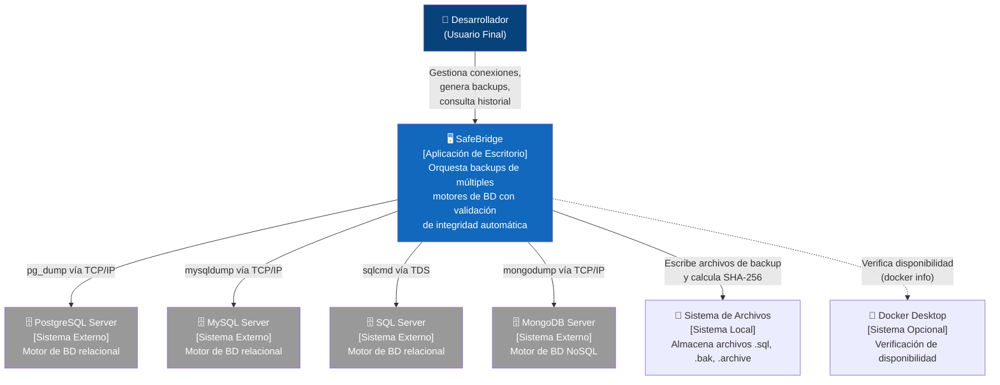

### 1.2 Nivel 2 — Diagrama de Contenedores

Desglosa SafeBridge en sus contenedores tecnológicos internos.

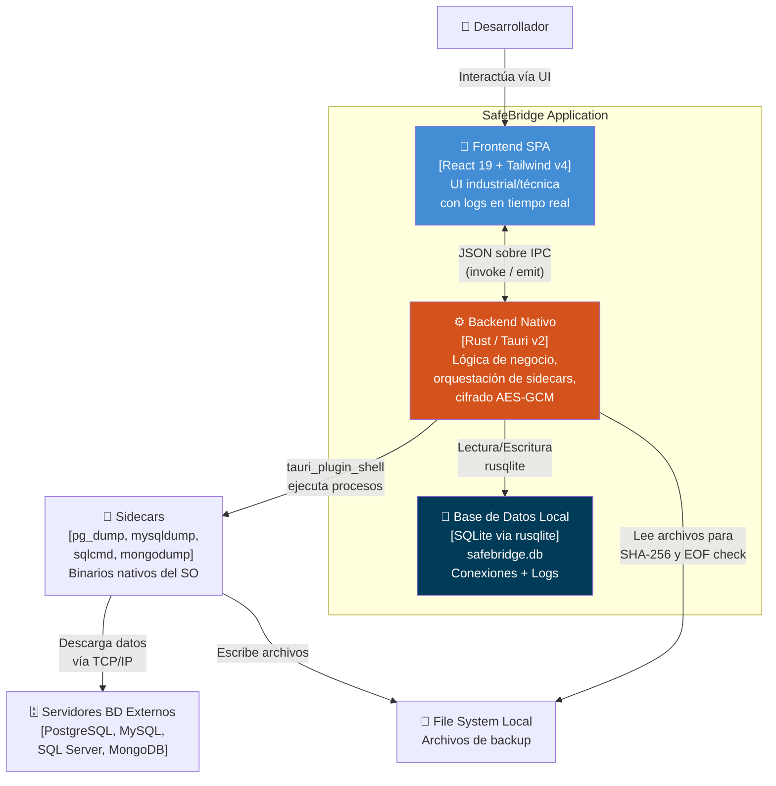

### 1.3 Nivel 3 — Diagrama de Componentes del Backend

Detalla los módulos Rust internos del backend.

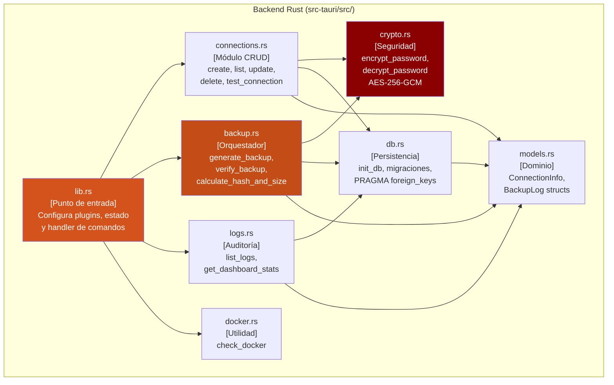

---

## 2. Diagrama de Casos de Uso

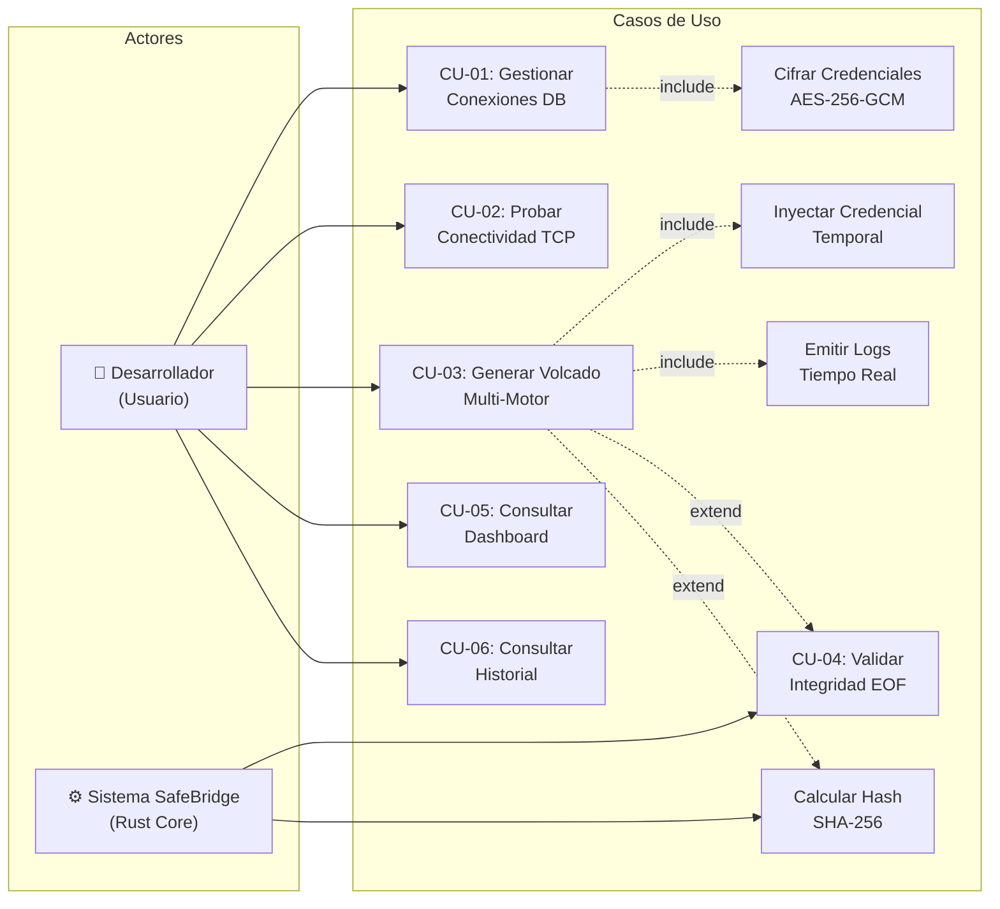

---

## 3. Diagrama de Paquetes

### 3.1 Paquetes del Frontend (TypeScript/React)

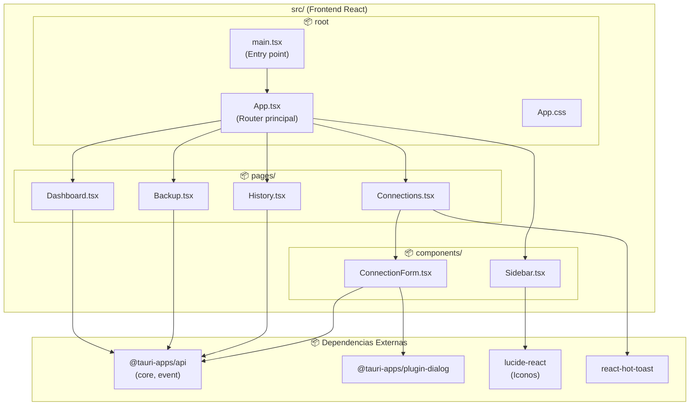

### 3.2 Paquetes del Backend (Rust/Tauri)

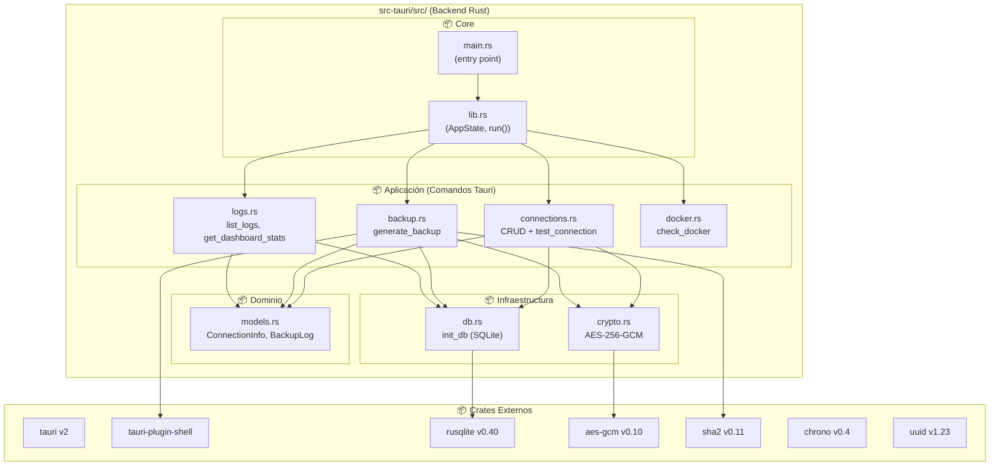

---

## 4. Diagramas de Secuencia

### 4.1 Creación Segura de Conexión y Prueba de Red

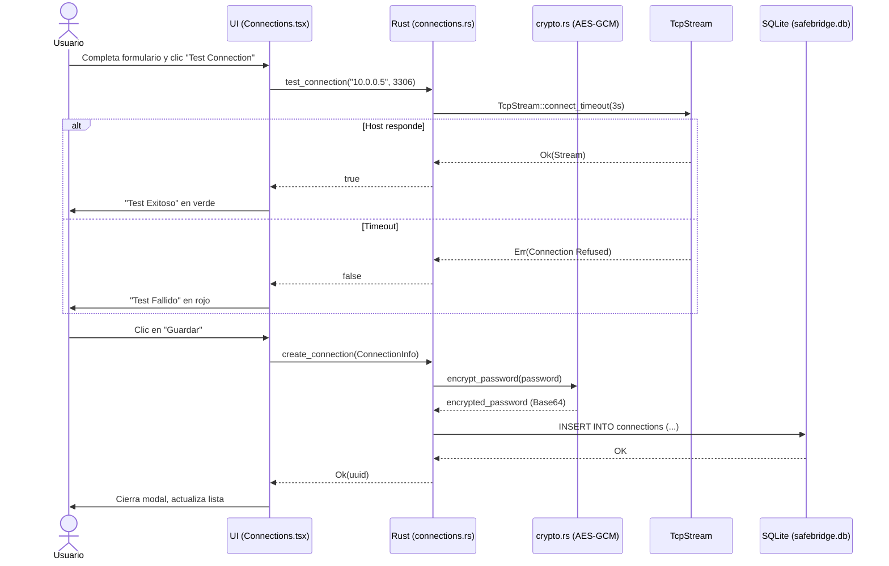

### 4.2 Flujo de Generación de Backup y Validación

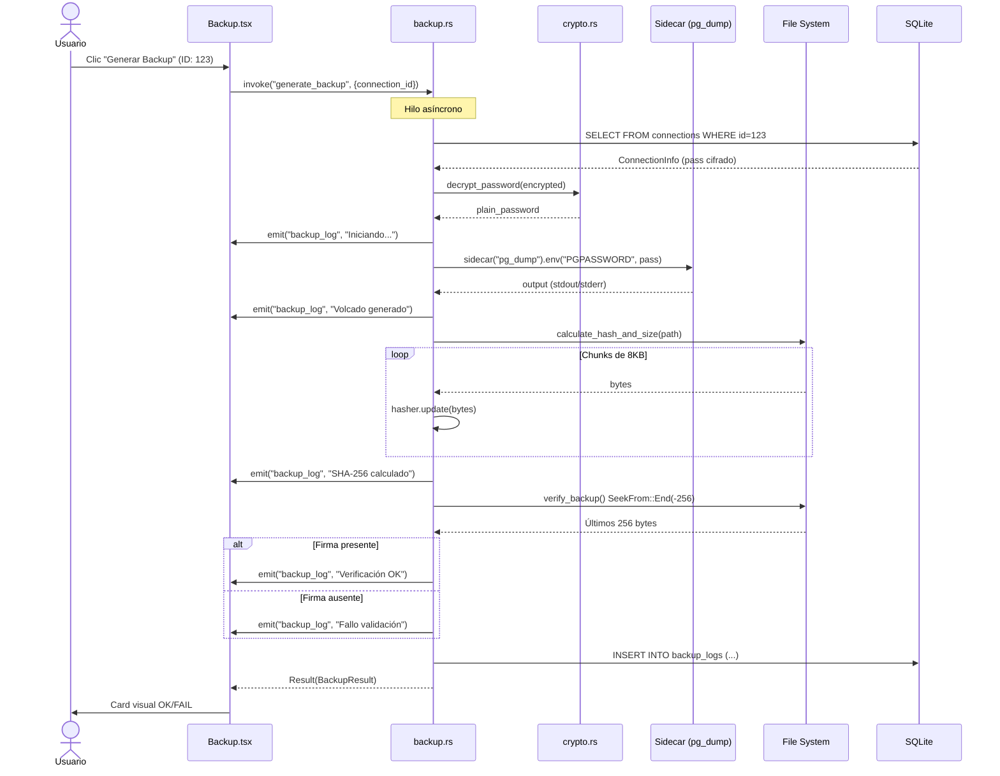

---

## 5. Diagrama de Clases / Estructuras

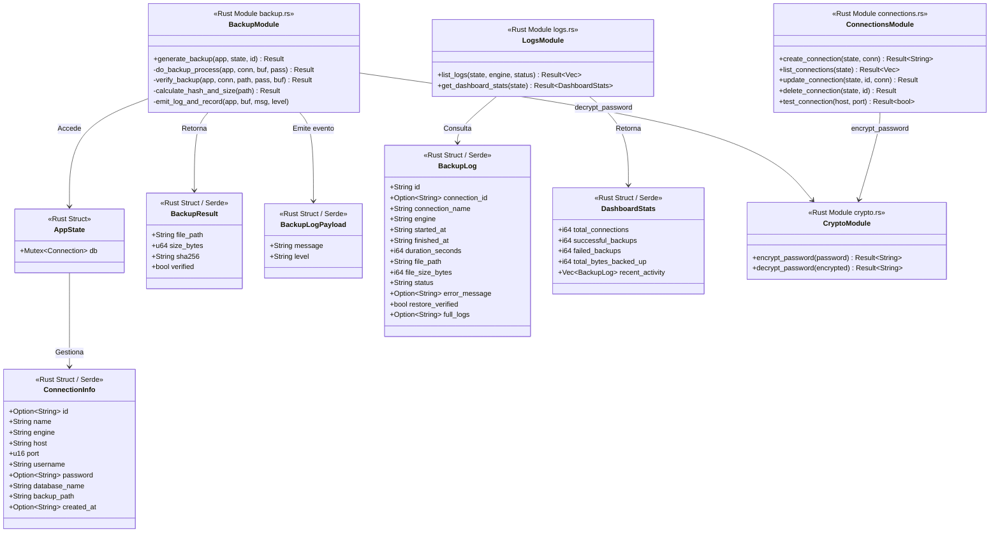

---

## 6. Diagrama de Base de Datos

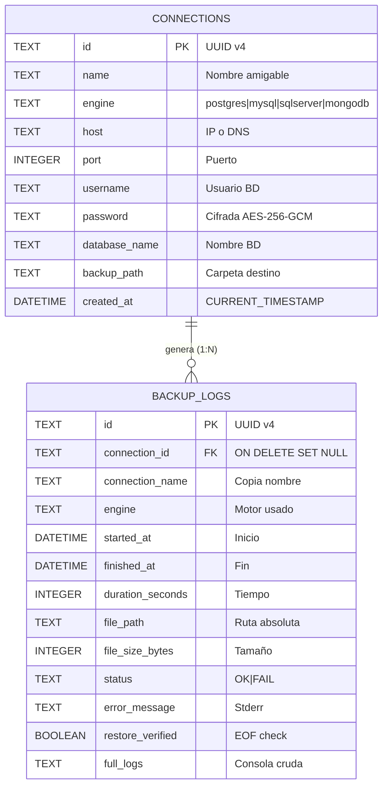

---

## 7. Diagrama de Componentes

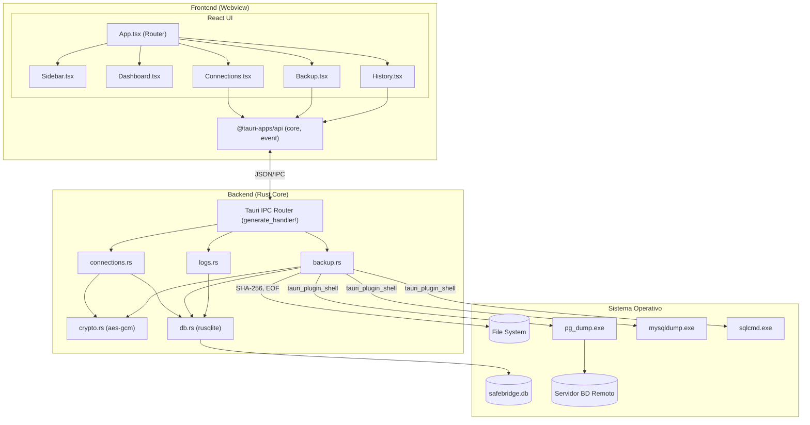

---

## 8. Diagrama de Despliegue

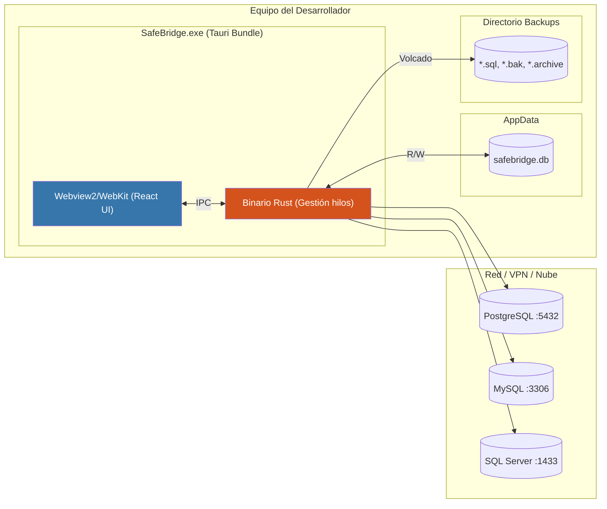

---

## 9. Diagrama de Arquitectura Clean

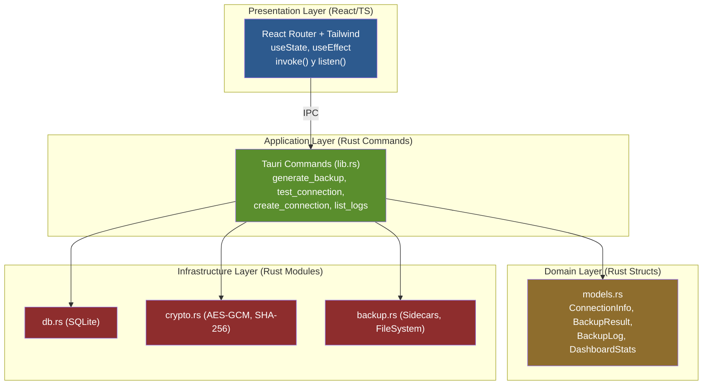

---

## 10. Diagrama de Infraestructura Terraform

> **Contexto:** Infraestructura teórica AWS para futuras versiones.

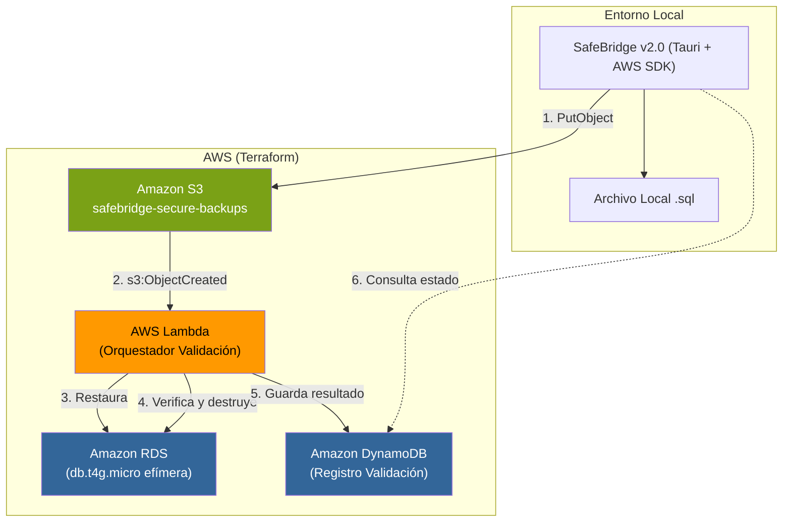

---

*Documento actualizado por el equipo BitCraft Solutions — Universidad Privada de Tacna, FAING-EPIS, Ciclo 2026-I.*
