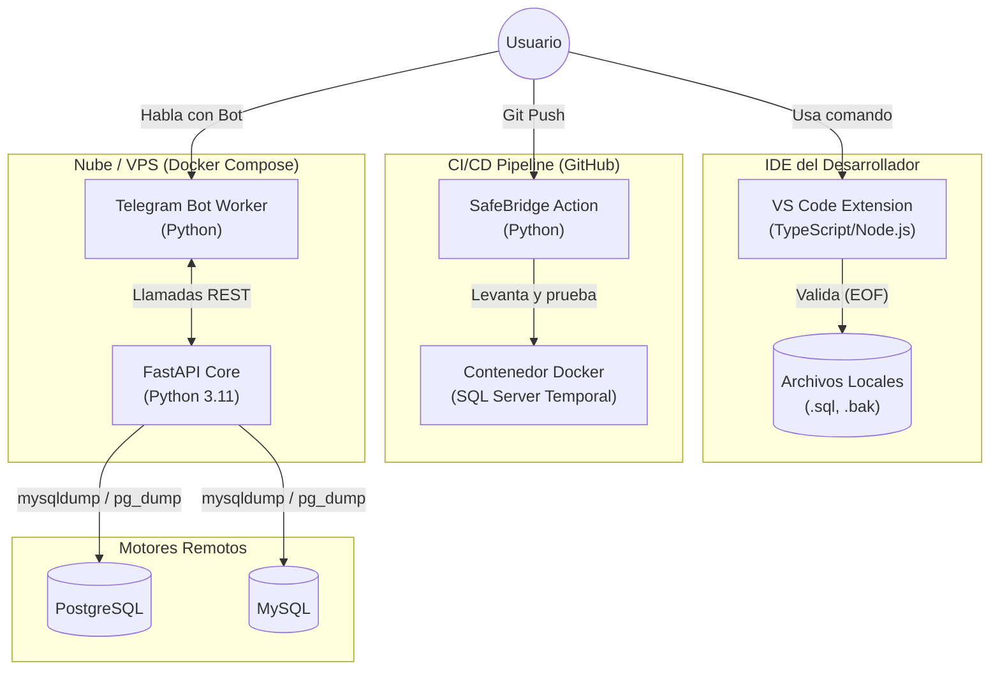
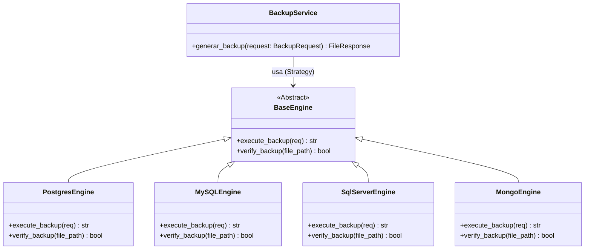
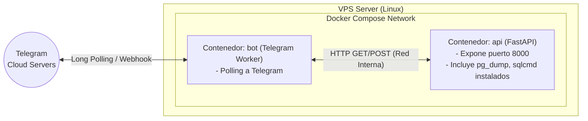
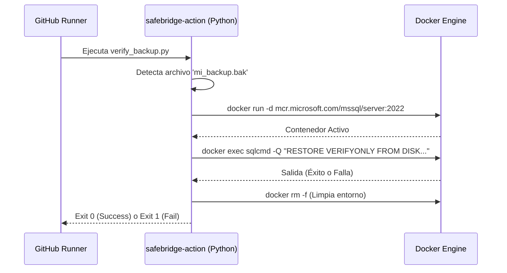

**UNIVERSIDAD PRIVADA DE TACNA**

**FACULTAD DE INGENIERÍA**

**Escuela Profesional de Ingeniería de Sistemas**

**Proyecto: *SafeBridge: Ecosistema Multi-Motor de Respaldos y Validación de Integridad***

Curso: *Base de Datos II*

Docente: *Ing. Patrick José Cuadros Quiroga*

Integrantes:

***Sierra Ruiz, Iker Alberto (2023077090)***

***Cortez Mamani, Julio Samuel (2023077283)***

**Tacna – Perú**

***2026***

Sistema *SafeBridge*

Diagramas de Arquitectura — FD04

Versión *3.0*

| CONTROL DE VERSIONES | | | | | |
|:---:|:---|:---|:---|:---|:---|
| Versión | Hecha por | Revisada por | Aprobada por | Fecha | Motivo |
| 2.0 | IASR / JSCM | Ing. P. Cuadros | Ing. P. Cuadros | 31/05/2026 | Actualización para Tauri/Rust Architecture |
| 3.0 | IASR / JSCM | Ing. P. Cuadros | Ing. P. Cuadros | 03/07/2026 | Actualización a Ecosistema (FastAPI, Action, VSCode) |

# ÍNDICE GENERAL

- [1. Diagrama de Arquitectura Global (Ecosistema)](#1-diagrama-de-arquitectura-global-ecosistema)
- [2. Diagrama de Clases (Patrón Estrategia - FastAPI)](#2-diagrama-de-clases-patrón-estrategia---fastapi)
- [3. Diagrama de Despliegue (Docker Compose)](#3-diagrama-de-despliegue-docker-compose)
- [4. Arquitectura de GitHub Action](#4-arquitectura-de-github-action)

---

## 1. Diagrama de Arquitectura Global (Ecosistema)

SafeBridge ahora opera como una arquitectura distribuida (ecosistema de herramientas).

---

## 2. Diagrama de Clases (Patrón Estrategia - FastAPI)

La lógica core de respaldo se apoya fuertemente en el **Strategy Pattern**, lo cual respeta el Principio Abierto/Cerrado (OCP) de SOLID.

---

## 3. Diagrama de Despliegue (Docker Compose)

El backend principal se despliega de forma muy sencilla en VPS mediante un archivo `docker-compose.yml`.

---

## 4. Arquitectura de GitHub Action

La arquitectura de validación dentro de integración continua aprovecha la capacidad de Python para orquestar contenedores Docker (`subprocess`) al interior del Runner de GitHub.

